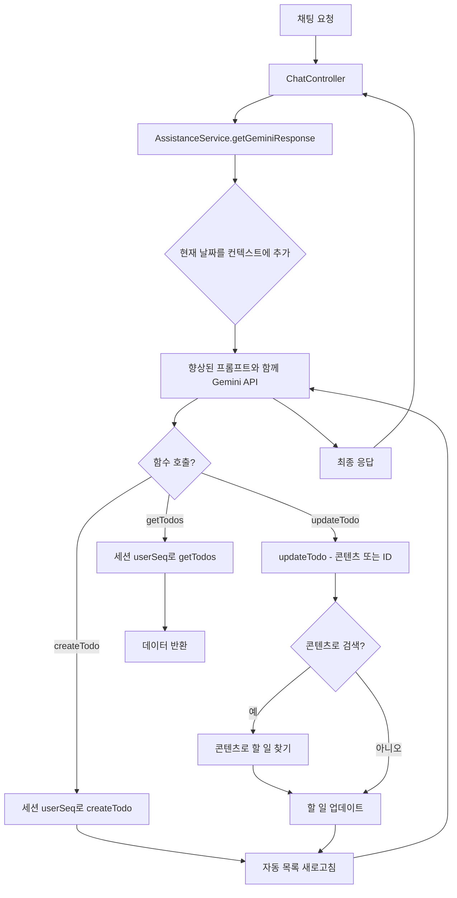
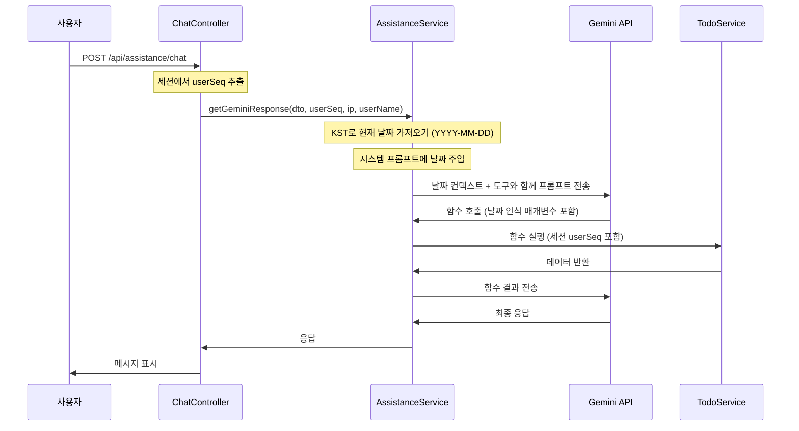

# 설계 문서

## 개요

이 설계 문서는 AI 어시스턴트 채팅 인터페이스에 대한 네 가지 중요한 향상 사항의 기술적 구현을 설명합니다: 날짜 인식, 콘텐츠 기반 업데이트, 사전 목록 새로고침, 그리고 세션 기반 보안 강화입니다. 이러한 향상 사항은 AI의 시간 추론을 개선하고, 상호작용을 더 자연스럽게 만들며, 자동 피드백을 통해 더 나은 UX를 제공하고, 강력한 보안을 보장합니다.

## 아키텍처

### 상위 수준 컴포넌트 변경사항



### 날짜 컨텍스트가 포함된 향상된 요청 흐름



## 컴포넌트 및 인터페이스

### 1. 날짜 인식 컨텍스트 주입

#### 구현 위치
- **파일**: `src/src/assistance/assistance.service.ts`
- **메서드**: `getGeminiResponse()`

#### 설계 세부사항

**현재 날짜 계산:**
```typescript
// KST(UTC+9)로 현재 날짜 가져오기
const getCurrentKSTDate = (): string => {
  const now = new Date();
  const kstOffset = 9 * 60; // KST는 UTC+9
  const kstTime = new Date(now.getTime() + kstOffset * 60 * 1000);
  return kstTime.toISOString().split('T')[0]; // YYYY-MM-DD
};
```

**시스템 프롬프트 향상:**
```typescript
// getGeminiResponse 메서드 내에서
const currentDate = getCurrentKSTDate();
const dateContext = `\n\n[CURRENT_DATE]\n오늘 날짜: ${currentDate} (YYYY-MM-DD 형식)\n이 날짜를 기준으로 "오늘", "내일", "다음 주" 등의 상대적 날짜를 계산하세요.`;

// 시스템 프롬프트에 추가
systemPrompt = systemPrompt + dateContext;
```

**시스템 프롬프트 파일 업데이트:**
- **파일**: `src/src/assistance/assistance.systemPrompt.txt`
- **추가**: 지침이 포함된 새로운 `[DATE_AWARENESS]` 섹션

```
[DATE_AWARENESS]
- 현재 날짜 정보가 [CURRENT_DATE] 섹션에 제공됩니다
- 사용자가 "오늘", "내일", "다음 주" 등을 언급하면 현재 날짜를 기준으로 계산하세요
- 사용자가 월/일만 제공하면 (예: "11월 14일"), 현재 연도를 사용하세요
- 날짜가 과거인 경우, 다음 연도를 의미하는지 사용자에게 확인하세요
- createTodo 함수 호출 시 항상 YYYY-MM-DD 형식의 완전한 날짜를 제공하세요
```

### 2. 콘텐츠 기반 할 일 업데이트

#### 구현 위치
- **파일**: `src/src/assistance/assistance.service.ts`
- **메서드**: `updateTodo()` (향상됨)
- **새 메서드**: `findTodoByContent()`

#### 설계 세부사항

**향상된 updateTodo 도구 정의:**
```typescript
private readonly updateTodoTool = {
  functionDeclarations: [
    {
      name: 'updateTodo',
      description: '기존 할 일을 수정합니다. todoSeq 또는 todoContent로 식별할 수 있습니다.',
      parameters: {
        type: 'OBJECT',
        properties: {
          todoSeq: {
            type: 'NUMBER',
            description: '수정할 할 일의 고유 ID (선택 사항 - todoContent가 제공되지 않은 경우 필수).',
          },
          todoContentToFind: {
            type: 'STRING',
            description: '수정할 할 일을 찾기 위한 내용 검색어 (선택 사항 - todoSeq가 제공되지 않은 경우 필수).',
          },
          todoContent: {
            type: 'STRING',
            description: '수정할 할 일의 새로운 내용 (선택 사항).',
          },
          isCompleted: {
            type: 'BOOLEAN',
            description: '완료 상태 (선택 사항). true로 설정하면 작업을 완료로 표시하고, false로 설정하면 미완료로 표시합니다.',
          },
          todoNote: {
            type: 'STRING',
            description: '수정할 메모 내용 (선택 사항).',
          },
        },
      },
    },
  ],
};
```

**새로운 findTodoByContent 메서드:**
```typescript
private async findTodoByContent(
  userSeq: number,
  contentToFind: string,
): Promise<{ success: boolean; todoSeq?: number; matches?: number; error?: string }> {
  try {
    // 사용자의 모든 할 일 가져오기
    const allTodos = await this.todoService.findAll(userSeq, new Date().toISOString().split('T')[0]);
    
    // 대소문자 구분 없는 검색
    const matches = allTodos.filter(todo => 
      todo.todoContent.toLowerCase().includes(contentToFind.toLowerCase())
    );
    
    if (matches.length === 0) {
      return { success: false, error: '일치하는 할 일을 찾을 수 없습니다.' };
    }
    
    if (matches.length > 1) {
      return { 
        success: false, 
        matches: matches.length,
        error: `"${contentToFind}"와 일치하는 할 일이 ${matches.length}개 있습니다. 더 구체적으로 지정해주세요.` 
      };
    }
    
    return { success: true, todoSeq: matches[0].todoSeq };
  } catch (error) {
    this.logger.error('[findTodoByContent] 검색 중 오류 발생', error);
    return { success: false, error: '할 일 검색에 실패했습니다.' };
  }
}
```

**향상된 updateTodo 메서드:**
```typescript
private async updateTodo(
  userSeq: number,
  ip: string,
  todoSeq?: number,
  todoContentToFind?: string,
  updateData: {
    todoContent?: string;
    isCompleted?: boolean;
    todoNote?: string;
  },
): Promise<any> {
  let targetTodoSeq = todoSeq;
  
  // todoSeq가 제공되지 않으면 콘텐츠로 검색
  if (!targetTodoSeq && todoContentToFind) {
    const searchResult = await this.findTodoByContent(userSeq, todoContentToFind);
    if (!searchResult.success) {
      return searchResult; // AI에게 오류 반환
    }
    targetTodoSeq = searchResult.todoSeq;
  }
  
  if (!targetTodoSeq) {
    return { success: false, error: 'todoSeq 또는 todoContentToFind가 필요합니다.' };
  }
  
  // 업데이트 DTO 구성
  const updateTodoDto: any = {};
  if (updateData.todoContent !== undefined) {
    updateTodoDto.todoContent = updateData.todoContent;
  }
  if (updateData.isCompleted !== undefined) {
    // 데이터베이스가 타임스탬프 생성: true = NOW(), false = NULL
    // TodoService/Repository가 데이터베이스 NOW() 함수를 사용하여 completeDtm 설정 처리
    updateTodoDto.completeDtm = updateData.isCompleted ? 'NOW()' : null;
  }
  if (updateData.todoNote !== undefined) {
    updateTodoDto.todoNote = updateData.todoNote;
  }
  
  // 기존 업데이트 로직 진행
  // ... (기존 코드)
}
```

**타임스탬프 생성에 대한 참고사항:**
`completeDtm` 필드는 TodoService/Repository 레이어가 데이터베이스 함수 호출로 해석할 특수 `'NOW()'` 문자열 값을 사용합니다. 이는 다음을 보장합니다:
- 타임스탬프가 데이터베이스 서버에서 생성됨 (애플리케이션 서버가 아님)
- 다른 감사 컬럼(regDtm, updDtm)과 일관성 유지
- 데이터베이스 수준에서 적절한 시간대 처리
- 업데이트 쿼리와 함께 원자적 작업

**시스템 프롬프트 업데이트:**
```
[CONTENT_BASED_UPDATES]
- 사용자가 할 일 ID를 모르는 경우, 할 일의 내용으로 검색할 수 있습니다
- updateTodo 함수 호출 시 todoSeq 대신 todoContentToFind를 사용할 수 있습니다
- 여러 개가 일치하면 사용자에게 더 구체적인 정보를 요청하세요
```

### 3. 쓰기 작업 후 사전 목록 새로고침

#### 구현 위치
- **파일**: `src/src/assistance/assistance.service.ts`
- **메서드**: `createTodo()`, `updateTodo()` (향상됨)
- **파일**: `src/src/assistance/assistance.systemPrompt.txt` (지침)

#### 설계 세부사항

**향상된 createTodo 메서드:**
```typescript
private async createTodo(
  userSeq: number,
  ip: string,
  todoContent: string,
  todoDate: string,
  todoNote?: string,
): Promise<any> {
  try {
    // ... 기존 생성 로직 ...
    const createdTodo = await this.todoService.create(user, ip, createTodoDto);
    
    // ✨ 새로운 기능: 생성 후 자동 목록 새로고침
    const refreshedList = await this.getTodos(userSeq, undefined, 7); // ±7일 가져오기
    
    return {
      success: true,
      data: {
        todoSeq: createdTodo.todoSeq,
        todoContent: createdTodo.todoContent,
        todoDate: createdTodo.todoDate,
        todoNote: createdTodo.todoNote,
        completeDtm: createdTodo.completeDtm,
        createdAt: createdTodo.auditColumns.regDtm.toISOString(),
      },
      refreshedList: refreshedList, // 새로고침된 목록 포함
    };
  } catch (error) {
    // ... 오류 처리 ...
  }
}
```

**향상된 updateTodo 메서드:**
```typescript
private async updateTodo(
  userSeq: number,
  ip: string,
  // ... 매개변수 ...
): Promise<any> {
  try {
    // ... 기존 업데이트 로직 ...
    const updatedTodo = await this.todoService.update(todoSeq, user, ip, updateTodoDto);
    
    // ✨ 새로운 기능: 업데이트 후 자동 목록 새로고침
    const refreshedList = await this.getTodos(userSeq, undefined, 7); // ±7일 가져오기
    
    return {
      success: true,
      data: {
        todoSeq: updatedTodo.todoSeq,
        todoContent: updatedTodo.todoContent,
        todoDate: updatedTodo.todoDate,
        todoNote: updatedTodo.todoNote,
        completeDtm: updatedTodo.completeDtm,
        updatedAt: updatedTodo.auditColumns.updDtm.toISOString(),
      },
      refreshedList: refreshedList, // 새로고침된 목록 포함
    };
  } catch (error) {
    // ... 오류 처리 ...
  }
}
```

**시스템 프롬프트 업데이트:**
```
[PROACTIVE_REFRESH]
- createTodo 또는 updateTodo 함수가 성공하면, 응답에 refreshedList가 포함됩니다
- 반드시 성공 메시지와 함께 refreshedList를 [FORMATTING_RULES]에 따라 표시하세요
- 예시: "네, [사용자 이름]님. 할 일을 생성했습니다. 현재 할 일 목록입니다:\n\n* **할 일 내용**: 날짜"
- 사용자가 별도로 목록을 요청하지 않아도 자동으로 표시하세요
```

### 4. 필수 세션 기반 보안

#### 구현 위치
- **파일**: `src/src/assistance/assistance.service.ts`
- **모든 함수 메서드**: `getTodos()`, `createTodo()`, `updateTodo()`

#### 설계 세부사항

**보안 원칙:**
- `userSeq`는 항상 인증된 세션에서 컨트롤러가 제공함
- `userSeq`는 절대 Gemini 함수 도구 정의의 매개변수가 아님
- 모든 데이터베이스 작업은 세션 `userSeq`로 범위가 지정됨

**현재 구현 검토:**
```typescript
// ✅ 올바름: userSeq는 세션에서 가져오며 AI에서 가져오지 않음
async getGeminiResponse(
  requestAssistanceDto: RequestAssistanceDto,
  userSeq?: number,  // 세션에서
  ip?: string,
  userName?: string,
): Promise<RequestAssistanceDto> {
  // ...
  
  // AI가 updateTodo를 호출할 때
  case 'updateTodo':
    if (userSeq && ip) {
      functionResult = await this.updateTodo(
        userSeq,  // ✅ 세션 userSeq, AI가 제어하지 않음
        ip,
        args.todoSeq,
        args.todoContentToFind,
        {
          todoContent: args.todoContent,
          isCompleted: args.isCompleted,  // ✅ Boolean, 타임스탬프 아님
          todoNote: args.todoNote,
        },
      );
    }
    break;
}

// ✅ 올바름: getTodos는 내부적으로 세션 userSeq를 사용함
private async getTodos(
  userSeq: number,  // 세션에서, AI에서 아님
  status?: string,
  days?: number,
): Promise<any> {
  // 모든 쿼리는 userSeq로 필터링됨
  const todos = await this.todoService.findAll(userSeq, targetDate);
  // ...
}
```

**도구 정의 (검증):**
```typescript
// ✅ 올바름: 도구 정의에 userSeq 매개변수 없음
private readonly getTodosTool = {
  functionDeclarations: [
    {
      name: 'getTodos',
      description: '사용자의 할 일 목록을 DB에서 조회합니다.',
      parameters: {
        type: 'OBJECT',
        properties: {
          status: { type: 'STRING', description: '...' },
          days: { type: 'NUMBER', description: '...' },
          // ✅ userSeq 매개변수 없음 - 내부 전용
        },
      },
    },
  ],
};
```

**TodoService 검증:**
```typescript
// TodoService 메서드가 userSeq로 필터링하는지 확인
async findAll(userSeq: number, targetDate: string): Promise<TodoEntity[]> {
  // ✅ 쿼리는 userSeq로 필터링해야 함
  return this.todoRepository.find({
    where: { userSeq, delYn: 'N' },
    // ...
  });
}

async update(todoSeq: number, user: UserEntity, ip: string, updateTodoDto: UpdateTodoDto) {
  // ✅ 할 일이 사용자에게 속하는지 확인해야 함
  const todo = await this.todoRepository.findOne({
    where: { todoSeq, userSeq: user.userSeq, delYn: 'N' },
  });
  
  if (!todo) {
    throw new NotFoundException('할 일을 찾을 수 없습니다.');
  }
  // ...
}
```

**보안 체크리스트:**
- ✅ userSeq는 인증된 세션에서 가져옴 (ChatController)
- ✅ userSeq는 AssistanceService.getGeminiResponse()에 전달됨
- ✅ userSeq는 모든 함수 호출에서 내부적으로 사용됨
- ✅ userSeq는 어떤 Gemini 도구 매개변수 정의에도 없음
- ✅ TodoService 메서드는 userSeq로 필터링함
- ✅ 업데이트/삭제 작업은 진행하기 전에 소유권을 확인함

### 5. 데이터베이스 작업에 대한 완전한 감사 추적

#### 구현 위치
- **파일**: `src/src/assistance/chat.controller.ts`
- **파일**: `src/src/assistance/assistance.service.ts`
- **파일**: `src/src/utils/auditColumns.ts`

#### 설계 세부사항

**문제 설명:**
이전에는 감사 컬럼(reg_id, upd_id, upd_ip)이 올바르게 채워지지 않았습니다:
- 생성 작업 시: reg_id가 비어 있었고, upd_id/upd_ip가 초기화되지 않았음
- userId가 ChatController에서 AssistanceService로 전달되지 않았음

**해결책:**

**1. ChatController 향상:**
```typescript
// 세션에서 AssistanceService로 userId 전달
const result = await this.assistanceService.getGeminiResponse(
  requestDto,
  session.user.userSeq,
  ip,
  session.user.userName,
  session.user.userId,  // ✨ 새로운 기능: 감사 로깅을 위한 userId 전달
);
```

**2. AssistanceService 메서드 시그니처:**
```typescript
// getGeminiResponse에 userId 매개변수 추가
async getGeminiResponse(
  requestAssistanceDto: RequestAssistanceDto,
  userSeq?: number,
  ip?: string,
  userName?: string,
  userId?: string,  // ✨ 새로운 기능: 감사 로깅용
): Promise<RequestAssistanceDto>

// createTodo에 userId 매개변수 추가
private async createTodo(
  userSeq: number,
  userId: string,  // ✨ 새로운 기능: 감사 로깅용
  ip: string,
  todoContent: string,
  todoDate: string,
  todoNote?: string,
): Promise<any>

// updateTodo에 userId 매개변수 추가
private async updateTodo(
  userSeq: number,
  userId: string,  // ✨ 새로운 기능: 감사 로깅용
  ip: string,
  todoSeq?: number,
  todoContentToFind?: string,
  updateData?: {
    todoContent?: string;
    isCompleted?: boolean;
    todoNote?: string;
  },
): Promise<any>
```

**3. 사용자 객체 구성:**
```typescript
// createTodo 및 updateTodo 메서드에서
const user = {
  userSeq,
  userId,  // ✨ 수정됨: 이제 세션의 실제 userId 사용
  userName: '',
  userEmail: '',
  userDescription: '',
  userProfileImageFileGroupNo: null,
  adminYn: 'N',
  auditColumns: null,
} as Omit<UserEntity, 'userPassword'>;
```

**4. 향상된 setAuditColumn 함수:**
```typescript
export function setAuditColumn(setting: AuditSettings) {
  const { entity, id, ip, isUpdate = false } = setting;

  if (isUpdate) {
    // 업데이트 작업: upd_id와 upd_ip만 설정
    entity.auditColumns.updId = id;
    entity.auditColumns.updIp = ip;
  } else {
    // ✨ 수정됨: 생성 작업 시 이제 reg_* 및 upd_* 컬럼 모두 설정
    entity.auditColumns.regId = id;
    entity.auditColumns.regIp = ip;
    entity.auditColumns.updId = id;  // 생성 시 upd_id 초기화
    entity.auditColumns.updIp = ip;  // 생성 시 upd_ip 초기화
  }

  return entity;
}
```

**감사 컬럼 채우기:**

| 작업 | reg_id | reg_ip | reg_dtm | upd_id | upd_ip | upd_dtm |
|------|--------|--------|---------|--------|--------|---------|
| **생성** | userId | 클라이언트 IP | NOW() | userId | 클라이언트 IP | NOW() |
| **업데이트** | (변경 없음) | (변경 없음) | (변경 없음) | userId | 클라이언트 IP | NOW() |

**이점:**
- 모든 할 일 작업에 대한 완전한 감사 추적
- 데이터 거버넌스 요구사항 준수
- 더 쉬운 디버깅 및 문제 해결
- 모든 엔티티에서 일관된 감사 컬럼 채우기

## 데이터 모델

### 향상된 함수 응답 모델

```typescript
// 향상된 createTodo/updateTodo 응답
interface WriteOperationResponse {
  success: boolean;
  data: {
    todoSeq: number;
    todoContent: string;
    todoDate: string;
    todoNote: string | null;
    completeDtm: string | null;
    isCompleted: boolean;  // completeDtm에서 파생됨
    createdAt?: string;
    updatedAt?: string;
  };
  refreshedList: {
    totalCount: number;
    todos: Array<{
      todoSeq: number;
      todoContent: string;
      todoDate: string;
      todoNote: string | null;
      completeDtm: string | null;
      isCompleted: boolean;
      isOverdue: boolean;
    }>;
    queryParams: {
      status?: string;
      days?: number;
      targetDate: string;
    };
  };
  error?: string;
}

// 콘텐츠 검색 결과
interface ContentSearchResult {
  success: boolean;
  todoSeq?: number;
  matches?: number;
  error?: string;
}

// 업데이트 데이터 인터페이스
interface UpdateTodoData {
  todoContent?: string;
  isCompleted?: boolean;  // Boolean 플래그, 타임스탬프 아님
  todoNote?: string;
}
```

## 오류 처리

### 날짜 파싱 오류
- 잘못된 날짜 형식은 명확한 오류 메시지를 반환해야 함
- 모호한 날짜는 현재 날짜 컨텍스트를 사용하여 해석되어야 함
- 합리적인 범위를 벗어난 미래 날짜(예: >10년)는 확인을 요청해야 함

### 콘텐츠 검색 오류
- 일치 항목 없음: "일치하는 할 일을 찾을 수 없습니다."
- 여러 일치 항목: "X개의 일치하는 할 일이 있습니다. 더 구체적으로 지정해주세요."
- 검색 실패: 오류 로그, 사용자에게 일반 오류 메시지 반환

### 보안 오류
- userSeq 누락: 401 Unauthorized 반환
- 할 일 소유권 불일치: 404 Not Found 반환 (존재를 드러내지 않음)
- 잘못된 세션: 로그인으로 리디렉션

## 테스트 전략

### 단위 테스트

**날짜 컨텍스트 테스트:**
- getCurrentKSTDate()가 올바른 YYYY-MM-DD 형식을 반환하는지 테스트
- 시스템 프롬프트에 날짜 컨텍스트 주입 테스트
- 상대 날짜(오늘, 내일 등)에 대한 날짜 계산 테스트

**콘텐츠 검색 테스트:**
- 정확한 일치가 올바른 todoSeq를 반환하는지 테스트
- 부분 일치 테스트 (대소문자 구분 없음)
- 여러 일치 항목이 개수와 함께 오류를 반환하는지 테스트
- 일치 항목 없음이 적절한 오류를 반환하는지 테스트
- 검색 쿼리의 특수 문자 테스트

**사전 새로고침 테스트:**
- createTodo가 refreshedList를 반환하는지 테스트
- updateTodo가 refreshedList를 반환하는지 테스트
- refreshedList에 관련 할 일(±7일)이 포함되는지 테스트
- refreshedList 형식이 getTodos 형식과 일치하는지 테스트

**보안 테스트:**
- userSeq가 도구 정의에 절대 없는지 테스트
- 모든 함수 호출이 세션 userSeq를 사용하는지 테스트
- TodoService 메서드가 userSeq로 필터링하는지 테스트
- 업데이트 작업에서 소유권 확인 테스트

### 통합 테스트

**엔드투엔드 날짜 인식:**
- 사용자가 "내일 작업 생성"이라고 말함 → 올바른 날짜 계산
- 사용자가 "11월 14일 작업 보여줘"라고 말함 → 올바른 연도 추론
- 사용자가 "오늘"이라고 말함 → 올바른 KST 날짜 사용

**엔드투엔드 콘텐츠 업데이트:**
- 사용자가 "'우유 사기' 작업 업데이트"라고 말함 → 올바른 할 일 찾아서 업데이트
- 사용자가 "쇼핑 작업 완료"라고 말함 → 모호함, AI가 명확히 요청
- 사용자가 "작업 123 업데이트"라고 말함 → ID로 여전히 작동

**엔드투엔드 사전 새로고침:**
- 사용자가 작업 생성 → 확인 + 업데이트된 목록 표시
- 사용자가 작업 완료 → 확인 + 업데이트된 목록 표시
- 목록이 적절한 형식 규칙 사용

**엔드투엔드 보안:**
- 사용자 A가 사용자 B의 할 일에 접근할 수 없음
- AI가 함수 호출에서 userSeq를 지정할 수 없음
- 세션 만료가 적절히 처리됨

## 성능 고려사항

### 날짜 계산
- 날짜 계산은 가벼움 (외부 호출 없음)
- 요청당 한 번 수행됨
- 무시할 수 있는 성능 영향

### 콘텐츠 검색
- 검색은 사용자 자신의 할 일로 제한됨 (이미 userSeq로 필터링됨)
- 데이터베이스 ILIKE 또는 애플리케이션 수준 필터링을 사용한 대소문자 구분 없는 검색
- 큰 할 일 목록(>1000개)의 경우 todoContent에 데이터베이스 인덱스 추가 고려

### 사전 새로고침
- 새로고침은 ±7일로 제한됨 (합리적인 범위)
- 기존 getTodos 메서드 재사용 (새 쿼리 없음)
- 쓰기 작업에 ~50-200ms 추가 (UX 이점에 대해 허용 가능)

## 보안 고려사항

### 세션 강제
- 모든 작업은 세션 userSeq를 사용해야 함
- 사용자가 제어할 수 있는 userSeq 매개변수 없음
- 쓰기 작업 전에 소유권 확인

### 입력 정제
- 콘텐츠 검색 쿼리는 정제되어야 함
- 날짜 입력은 검증되어야 함
- 모든 사용자 입력은 데이터베이스 쿼리 전에 이스케이프되어야 함

### 데이터 유출 방지
- 다른 사용자의 할 일 존재를 절대 드러내지 않음
- 무단 접근에 대해 404 반환 (403이 아님)
- 모니터링을 위해 보안 위반 로그

## 배포 계획

### 1단계: 날짜 인식 (낮은 위험)
- 시스템 프롬프트에 날짜 컨텍스트 추가
- 다양한 날짜 쿼리로 테스트
- 잘못된 날짜 해석 모니터링

### 2단계: 콘텐츠 기반 업데이트 (중간 위험)
- findTodoByContent 메서드 구현
- updateTodo 도구 정의 업데이트
- 다양한 콘텐츠 쿼리로 테스트
- 모호한 일치 모니터링

### 3단계: 사전 새로고침 (낮은 위험)
- 쓰기 작업 응답에 refreshedList 추가
- 새로고침 지침으로 시스템 프롬프트 업데이트
- 응답 형식 테스트
- 응답 시간 모니터링

### 4단계: 보안 감사 (중요)
- userSeq 사용에 대한 모든 코드 경로 검토
- 도구 정의에 userSeq 매개변수가 없는지 확인
- 교차 사용자 접근 시도 테스트
- 보안 침투 테스트
